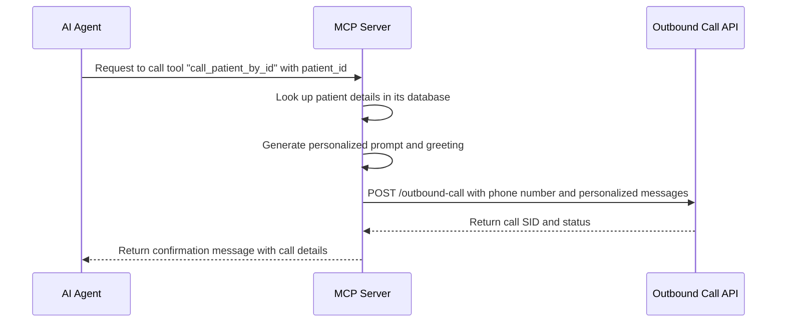

# 📞 Outbound Call MCP Server

This project implements a **Model Context Protocol (MCP) server** that enables an AI agent to make outbound phone calls, retrieve patient information, and initiate calls to patients by their ID. It is designed to be integrated with a conversational AI to automate patient outreach for appointment scheduling and other notifications.

-----

## ✅ Core Features

  - **MCP Integration**: Built on the `@modelcontextprotocol/sdk`, allowing it to be seamlessly used as a tool by a compatible AI agent.
  - **Outbound Calling**: Initiates phone calls using a configurable API endpoint, intended to connect with services like ElevenLabs and Twilio.
  - **Patient Database**: Includes a mock patient database for testing, allowing the retrieval of patient details by ID.
  - **Personalized Communication**: Dynamically generates personalized prompts and greetings for calls based on patient data.
  - **Three Core Functions**:
    1.  `make_outbound_call`: Directly makes a phone call to a given number.
    2.  `get_patient_details`: Fetches patient information from the database.
    3.  `call_patient_by_id`: Combines patient lookup and outbound calling to streamline the process of contacting patients.

-----

## Project Structure

```
.
└── MCP_server_medical/
    ├── server.js         # The main MCP server implementation
    └── package.json     # Project dependencies and scripts
```

-----

## Setup Instructions

### 1️⃣ Prerequisites

  - Node.js and npm installed
  - An existing MCP-compatible AI agent to interact with this server.
  - An outbound calling API endpoint (e.g., a service built with Twilio and ElevenLabs) that the server can connect to.

-----

### 2️⃣ Install Dependencies

```bash
npm install
```

### 3️⃣ Configure Environment Variables

Create a `.env` file in the project root and add the following:

```
OUTBOUND_CALL_API_URL=http://localhost:8000
```

Replace `http://localhost:8000` with the actual URL of your outbound calling API.

### 4️⃣ Running the Server

```bash
node index.js
```

The server will start and listen for requests on stdio.

-----

## Available Functions

| Function Name | Description |
| :--- | :--- |
| **`make_outbound_call`** | Initiate an outbound phone call using an AI agent. Requires a phone number and accepts optional custom prompts and initial messages. |
| **`get_patient_details`** | Retrieve patient details by their unique patient ID from the mock database. |
| **`call_patient_by_id`** | Look up a patient by their ID and initiate a personalized outbound call to them for a specified purpose (e.g., scheduling a follow-up appointment). |

-----

## Example Use Cases

  - **Automated Appointment Reminders**: Use the `call_patient_by_id` function to have an AI agent call patients who are due for their next appointment.
  - **Patient Information Retrieval**: Integrate with a chatbot to allow hospital staff to quickly look up patient details using the `get_patient_details` function.
  - **General Purpose Calling**: Use the `make_outbound_call` function for any scenario where an automated outbound call is needed.

-----

## Workflow

